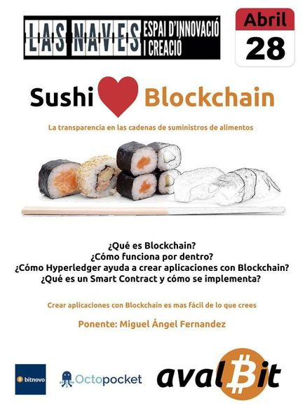

# Sushi ❤️ Blockchain

Video:

Blockchain ha transcendido las criptomonedas. Multitud de industrias han detectado los beneficios del modelo descentralizado de Blockchain y están explorando nuevas soluciones para sus problemas comunes.
Por ejemplo, las cadenas de suministro de alimentos, el caso que veremos en la presentación, es una de las aplicaciones más beneficiadas especialmente por la transparencia que Blockchain aporta.

Para dar servicio a la demanda industrial de productos basados en Blockchain se han creado consorcios de empresas que desarrollan plataformas agnósticas de su uso final. Una de estas plataformas es [Hyperledger](https://www.hyperledger.org/). **¿Qué es Blockchain? ¿Cómo funciona por dentro? ¿Cómo Hyperledger ayuda a crear aplicaciones con Blockchain? ¿Qué es un [Smart Contract](https://es.wikipedia.org/wiki/Contrato_inteligente) y cómo se implementa?** Pásate por la charla y no solo se despejarán tus dudas teóricas, también comprobarás con una demo que **crear aplicaciones con Blockchain es mas fácil de lo que crees**.

Miguel Angel Fernández es un experimentado programador. No come pescado crudo, pero le encanta Blockchain. Es [@elmendalerenda](https://twitter.com/elmendalerenda) en twitter.

##Recursos
[How to prepare and write a tech conference talk](http://wunder.schoenaberselten.com/2016/02/16/how-to-prepare-and-write-a-tech-conference-talk/)

---
Licensed under [Creative Commons Attribution 4.0](LICENSE.md)

Shower is licensed under [MIT License](LICENSE-shower.md).
